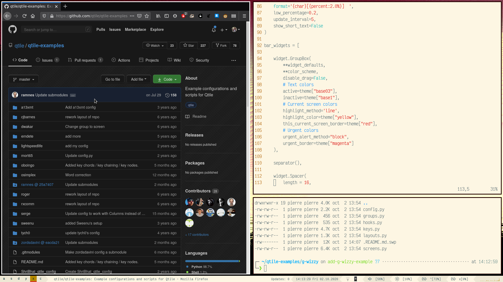

# G-Wizzy's qtile config files

The main interest in these config files might be the shortcuts in keys.py and the bar customization in screens.py.

Some parts of the the code (for instance the screenshot or multi-screen shortcuts in keys.py) reference some scripts that I have not included, since they aren't relevant in this repository. Feel free to contact me if you are interested.

## Volume and brightness control

Using the `shift` key when adjusting either the volume or the screen's brightness allows for finer tuning.

Note that my bar's volume widget displays a value that seems wrong. I don't know why, but it kind of works well enough for me anyway.

## Screenshot

The `PrtSc` key allows for screenshots, and saves the image in `~/Pictures/` as `<datetime>.png`. Holding the `Ctrl` key saves the image to the clipboard instead, and the `Shift` key allows selecting the portion of the screen to capture.

## Images

